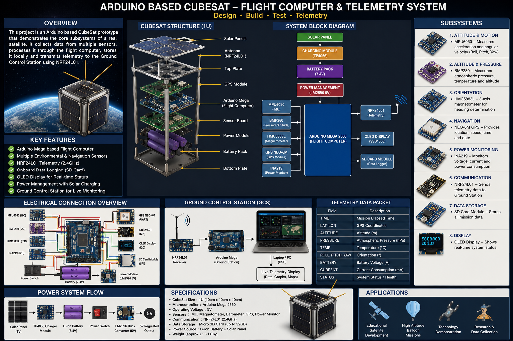

# 🚀 Arduino UNO Based CubeSat Flight Computer & Telemetry System



## 📖 Overview

The Arduino UNO Based CubeSat Flight Computer & Telemetry System is an educational aerospace engineering project that simulates the primary subsystems of a real CubeSat satellite.

The system collects data from multiple onboard sensors, processes telemetry through an Arduino UNO flight computer, stores mission data locally, and transmits telemetry wirelessly to a Ground Control Station (GCS) using NRF24L01 communication modules.

This project provides hands-on experience in:

- Embedded Systems
- Aerospace Electronics
- CubeSat Architecture
- Wireless Communication
- Telemetry Systems
- Flight Software Development
- Ground Station Design

---

# 🎯 Project Objectives

- Develop a CubeSat Flight Computer
- Implement Real-Time Sensor Monitoring
- Design Wireless Telemetry Communication
- Build a Ground Control Station
- Perform Onboard Data Logging
- Monitor Battery and Power Systems
- Simulate CubeSat Mission Operations

---

# 🛰️ System Architecture

```text
                    CubeSat Payload

  MPU6050
  BMP280
  GPS
  INA219
      │
      ▼

+--------------------+
| Arduino UNO        |
| Flight Computer    |
+--------------------+
      │
      ├── OLED Display
      ├── SD Card Logger
      ├── Power Monitoring
      │
      ▼

+--------------------+
| NRF24L01 Radio     |
+--------------------+
      │
      ▼

Wireless Telemetry

      │
      ▼

+--------------------+
| Ground Station     |
| Arduino + Laptop   |
+--------------------+
```

---

# 🔧 Hardware Components

| Component      | Purpose                 |
| -------------- | ----------------------- |
| Arduino UNO    | Flight Computer         |
| MPU6050        | IMU Sensor              |
| BMP280         | Altitude & Pressure     |
| GPS NEO-6M     | Navigation              |
| INA219         | Power Monitoring        |
| NRF24L01       | Telemetry Communication |
| OLED SSD1306   | Status Display          |
| SD Card Module | Data Logging            |
| Li-Ion Battery | Power Source            |
| Solar Panel    | Power Generation        |

---

# 📡 Features

- Real-Time Sensor Monitoring
- Wireless Telemetry
- GPS Tracking
- Battery Monitoring
- Data Logging
- OLED Status Display
- Ground Station Monitoring
- Modular Software Architecture
- CubeSat Mission Simulation

---

# 📂 Project Structure

```text
CubeSat_UNO/
│
├── include/
│   ├── config.h
│   ├── pin_map.h
│   ├── telemetry_packet.h
│
├── src/
│   ├── main.cpp
│   │
│   ├── sensors/
│   ├── communication/
│   ├── mission/
│   ├── power/
│   ├── display/
│   └── storage/
│
├── lib/
│
├── test/
│
├── docs/
│
├── hardware/
│
├── ground_station/
│
├── platformio.ini
│
├── LICENSE
│
└── README.md
```

---

# ⚙️ Firmware Workflow

```text
BOOT
 │
 ▼
Initialize Sensors
 │
 ▼
Read Sensor Data
 │
 ▼
Process Data
 │
 ▼
Create Telemetry Packet
 │
 ▼
Store to SD Card
 │
 ▼
Transmit via NRF24L01
 │
 ▼
Update OLED Display
 │
 ▼
Monitor Power System
 │
 ▼
Repeat
```

---

# 📊 Telemetry Parameters

| Parameter       | Description          |
| --------------- | -------------------- |
| Timestamp       | Mission Time         |
| Latitude        | GPS Latitude         |
| Longitude       | GPS Longitude        |
| Altitude        | Calculated Altitude  |
| Temperature     | BMP280 Reading       |
| Pressure        | Atmospheric Pressure |
| Roll            | IMU Roll Angle       |
| Pitch           | IMU Pitch Angle      |
| Yaw             | Heading Direction    |
| Battery Voltage | Battery Status       |
| Current         | Current Consumption  |
| System Status   | Health Status        |

---

# 🔋 Power System

```text
Solar Panel
     │
     ▼
TP4056 Charger
     │
     ▼
Li-Ion Battery
     │
     ▼
LM2596 Buck Converter
     │
     ▼
5V Power Rail
     │
     ▼
All Modules
```

---

# 🖥️ Ground Control Station

The Ground Control Station receives telemetry from the CubeSat and provides:

- Live Telemetry Monitoring
- Graph Visualization
- GPS Tracking
- Data Logging
- Mission Status Monitoring
- Alert Generation

---

# 🛠️ Development Environment

### IDE

- Visual Studio Code
- PlatformIO

### Programming Language

- C++
- Arduino Framework

### Libraries

- RF24
- TinyGPS++
- Adafruit MPU6050
- Adafruit BMP280
- Adafruit INA219
- Adafruit SSD1306

---

# 🚀 Build Instructions

## Clone Repository

```bash
git clone https://github.com/ShivamMathtech/advance-CubeSat-projeect-iiot
```

## Open Project

```bash
VS Code → PlatformIO → Open Project
```

## Build

```bash
pio run
```

## Upload

```bash
pio run --target upload
```

## Serial Monitor

```bash
pio device monitor
```

---

# 🧪 Testing Sequence

### Test 1

- LED Blink

### Test 2

- MPU6050 Sensor

### Test 3

- BMP280 Sensor

### Test 4

- GPS Communication

### Test 5

- NRF24L01 Telemetry

### Test 6

- OLED Display

### Test 7

- Full System Integration

---

# 📈 Future Improvements

- LoRa Telemetry
- STM32 Flight Computer
- Kalman Filter
- Attitude Determination System
- Reaction Wheel Simulation
- Solar Power Tracking
- AI-Based Telemetry Analysis
- CubeSat Ground Station Dashboard

---

# 📚 Applications

- Educational CubeSat Development
- CanSat Competitions
- High Altitude Balloon Missions
- Aerospace Research
- Embedded Systems Training
- Telemetry Demonstrations
- Flight Computer Prototyping

---

# 👨‍💻 Author

**Shivam Singh**

Embedded Systems | Aerospace Systems | CubeSat Development

---

# 📄 License

MIT License

Copyright (c) 2026 Shivam Singh

Permission is hereby granted, free of charge, to any person obtaining a copy of this software and associated documentation files to use, modify, merge, publish, distribute, sublicense, and/or sell copies of the Software.

See the LICENSE file for complete details.

---

# ⭐ Support

If you found this project useful:

⭐ Star the repository

🔁 Share with fellow engineers

🚀 Build your own CubeSat

📡 Explore aerospace engineering
